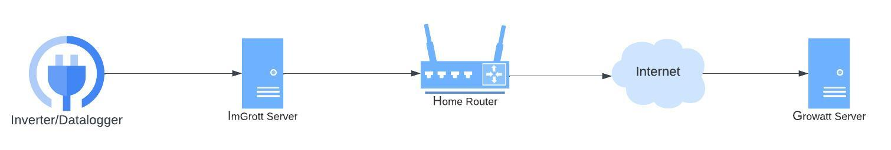

# Proxy Mode

The Proxy mode aims to receive the data from the Inverter/Datalogger and forward to Growatt's servers. You can see in 
the image below how it originally works and how it will be using ImGrott.

In order to achieve that we need to configure the Datalogger to send the data to ImGrott server instead of Growatt's 
servers. 

**Hold in mind that all these can change any time Growatt update their servers or update any firmware. If you find a new
way to achieve what we are trying here, please, make a PR.**

There is two ways to do that:
## Modifying the Datalogger's settings through Growatt portal
First, you need to access [Growatt dashboard](https://server.growatt.com). Then, go to your devices and click on 
`All Devices`.

Then, find your Datalloger and click on `Datalogger Setting`.

You can either choose a domain(if you have an internal DNS server, e.g.: imgrowatt.myhome.com) or an 
IP address(e.g.: 192.168.0.100).

At this time, the password is `growatt<date>`, for example if it is January 1st 2024 the password will be 
`growatt20240101`.

> **Note**
> This didn't work for me. I am not sure why. It may have happened because I didn't properly restart my Datalogger 
> at that time.

## Modifying the Datalogger's setting through AP Mode

This option can be a little tricky since it can vary according to your Datalogger and firmware version. If you find a 
different way to do it, please, make a PR.

> **NOTE**
> Remember to restart the datalogger (or even remove and put it back) to make sure that it will reload the new settings.

### Growatt ShineWifi(S/X)
#### Method 1

1. Put the device to AP mode (check the manual for that or reset it)
2. Connect to Datalogger SSID. Password should be `12345678`.
3. Access `http://192.168.10.100`. Login: `admin` | Password: `12345678`
4. Go to `Advanced Settings`

> **NOTE**
> This method may does not work due to the firmware version. The page couldn't be loaded.
> 
> This method didn't work with ShineWifi-X and firmware 3.1.0.5.

#### Method 2
1. Put the device to AP mode (check the manual for that or reset it)
2. Connect to Datalogger SSID using your smartphone. Password should be `12345678`.
3. Open ShineApp
4. Click on the button to `Configure Wifi datalogger`

5. Choose `Hotspot mode`

6. Follow the instructions in the app.
7. Click in `Advanced Settings`
## Troubleshooting
### Set up a domain, but I can't see any connection attempt in the server
During my own setup I had issues with the domain option. It kept requesting the DNS but never connected to the server. 
Then, I used the IP address option.